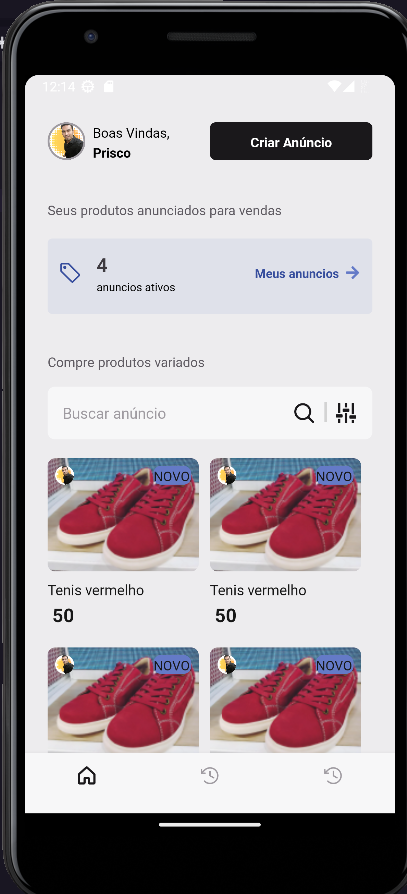
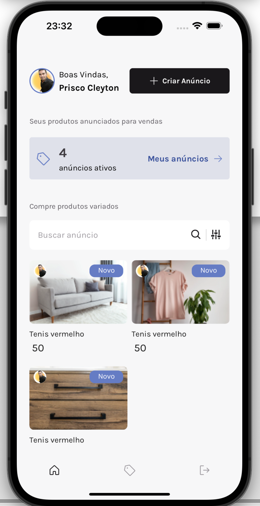

# Desafio Ignite Rocketseat -  Marketspace 

### Sobre:
Uma aplicação mobile em React Native de anúncios de produtos estilo OLX, que contém as seguintes funcionalidades:

### Demo:
<h1 align="center">
  
  
</h1>

    

### Funcionalidades:
- Login e cadastro de usuários
- Gerenciamento de produtos
- Listagem de produtos com busca e filtros
- Envio de múltiplas imagens
- Ativar/Desativar/Remover anúncio

E outras coisinhas.

### Ferramentas, Técnicas e Bibliotecas da API:
Foram utilizadas as seguintes temas:

- Consumo de API (com Autenticação JWT)
- Upload de imagens
- Validação de formulários
- Hooks
- ContextAPI
- React Navigation
- LocalStorage
- Typescript

</h1>

